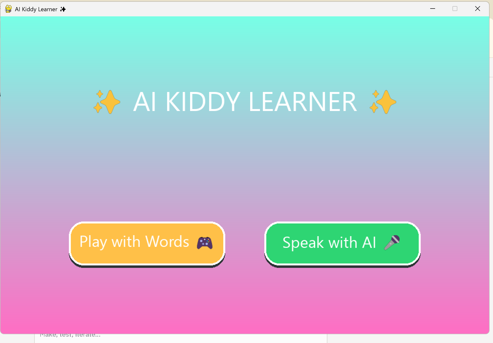

# ✨ AI Kiddy Learner

An adaptive, AI-driven educational game designed to help kindergarten children (aged 4–6) learn English vocabulary through interactive image-based challenges, audio cues, and intelligent feedback.

Built with Python and Pygame for the **CCC1243 Artificial Intelligence** Group Project at **Albukhary International University**.

---

## 📋 Project Overview

| Detail | Info |
|---|---|
| **Course** | CCC1243 – Artificial Intelligence |
| **Institution** | Albukhary International University |
| **Target Audience** | Kindergarten children aged 4–6 |
| **Educational Goal** | English Vocabulary Learning |
| **Submission Date** | 25th June 2026 |

---

## 🎮 Game Features

- **Play with Words Mode** — Children are shown an image and must pick the correct word from 4 multiple-choice buttons
- **Speak with AI Mode** — Voice-based interaction using microphone input and speech synthesis (VUI bonus feature)
- **Live Score Tracker** — Score increases by +15 for every correct answer
- **Smart Hint System** — When a wrong answer is given, the AI provides a friendly, age-appropriate hint specific to that word
- **Adaptive AI Engine** — Tracks mistakes and adjusts contextual feedback based on the child's input patterns
- **Audio Playback** — Each vocabulary item plays its pronunciation sound to reinforce learning
- **Meme Reactions** — Animated visual responses (happy / try-again) make feedback fun and engaging

---

## 🗂️ Project Structure

```
AI_FINAL_PROJECT/
│
├── main.py                  # Entry point — initializes Pygame and launches the app
│
├── ai_engine/               # Core AI logic
│   ├── __init__.py
│   └── adaptive_ai.py       # Adaptive feedback and mistake tracking engine
│
├── assets/
│   ├── images/              # Vocabulary images (apple, banana, cat, dog, lion)
│   │   └── memes/           # Reaction images (happy.png, try_again.png)
│   └── sounds/              # Audio pronunciation files (.mp3)
│
├── game_data/               # Persistent game/score data
├── gui/                     # All screen UI modules
│   └── start_screen.py      # Main start screen with mode selection
├── integration/             # Voice/AI integration modules
├── model/                   # AI/ML model files
│
├── .gitignore
└── README.md
```

---

## 🧠 How the AI Works

The `EnglishAIEngine` class powers the game's intelligence:

1. **Random Question Generation** — Randomly selects a vocabulary item from the dataset so each session feels fresh
2. **Answer Checking** — Compares the child's selection to the correct word
3. **Adaptive Hints** — If the child answers incorrectly, the engine retrieves a specific, word-linked hint (e.g., *"It is a long yellow fruit!"* for BANANA) instead of a generic wrong-answer message
4. **Mistake Tracking** — The `mistake_tracker` dictionary logs which words a child struggles with, enabling future adaptive difficulty adjustment

---

## 🚀 How to Run

### Prerequisites

```bash
pip install pygame
pip install openai-whisper
```

### Run the Game

```bash
python main.py
```
## 🖼️ Screenshots

| Start Screen |
|---|
|  |

The start screen presents two modes with large, colorful buttons suitable for young children.

📚 Vocabulary Dataset
The current dataset includes the following words, each with an image, audio file, 4 answer choices, and a hint:

Word	Hint
🍌 BANANA	It is a long yellow fruit!
🍎 APPLE	It can be red or green and keeps the doctor away!
🦁 LION	He is the King of the Jungle! 👑
🐱 CAT	It says 'Meow' and loves to drink milk!
🐶 DOG	Man's best friend! It says 'Woof Woof'!

🎙️ Voice User Interface (VUI) — Bonus Feature
The Speak with AI mode captures the child's spoken answer via microphone, transcribes it using OpenAI Whisper, and speaks back using text-to-speech synthesis. This earns up to +15 bonus marks per the assignment rubric.

📹 YouTube Presentation
🎬 Video Link: 

📄 License
This project was developed for academic purposes under CCC1243 at Albukhary International University.
