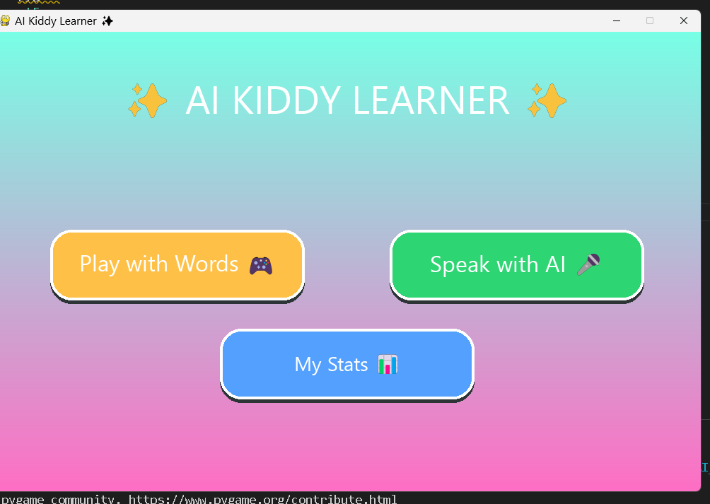
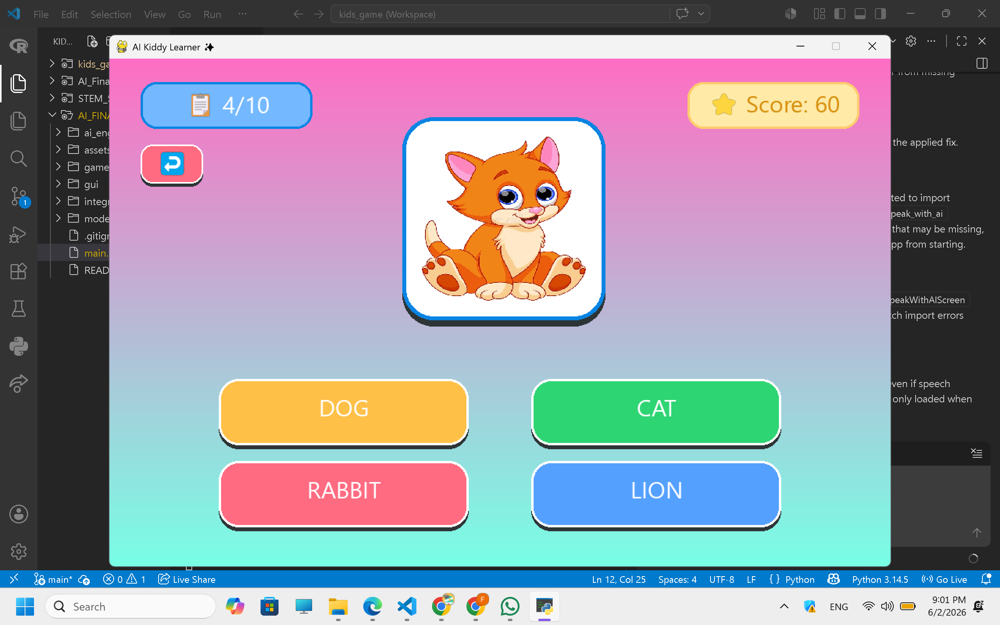
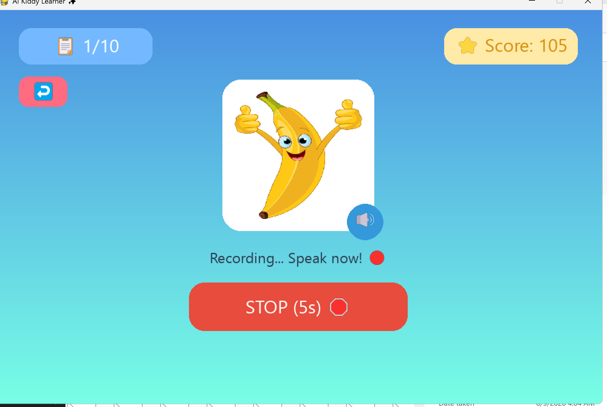
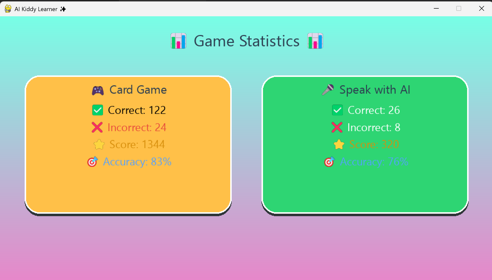

# 🎓 AI Kiddy Learner

An AI-assisted educational game developed using **Python** and **Pygame** to help kindergarten children (ages 4–6) learn English vocabulary through interactive gameplay, adaptive learning, and voice recognition.

---

## 📖 Overview

AI Kiddy Learner was developed as the final group project for the **CCC1243 Artificial Intelligence** course at **Albukhary International University**.

The game combines educational content with Artificial Intelligence techniques to create a personalized learning experience. Children practice vocabulary through picture-based quizzes while the system adapts future questions according to their previous mistakes. The project also includes a voice interaction feature that allows learners to practice pronunciation using speech recognition.

---

## ✨ Features

- 🧸 Child-friendly graphical interface
- 🖼️ Picture-based vocabulary quiz
- 🤖 Adaptive AI learning system
- 🎤 Voice recognition using Vosk
- 🔊 Audio feedback and sound effects
- 📊 Live score tracking
- 📈 Performance statistics
- 😊 Positive reinforcement for young learners

---

## 🛠 Technologies Used

- Python
- Pygame
- Vosk Speech Recognition
- Object-Oriented Programming (OOP)
- Artificial Intelligence (Adaptive Learning)

---

## 🧠 AI Implementation

The intelligence of the game is implemented through an adaptive learning engine.

Instead of selecting vocabulary questions randomly, the system records incorrect answers and increases the likelihood of presenting those words again. This helps learners receive additional practice on concepts they find more challenging, creating a more personalized educational experience.

---

## 📂 Project Structure

```
main.py
│
├── start_screen.py
├── game_play.py
├── adaptive_ai.py
├── speak_with_ai.py
├── audio_manager.py
├── statistics.py
└── assets/
```

---

## 👥 Team Members

| Member | Role |
|---------|------|
| **Bekhzodbek Akhmadaliev** | 💻 Coding Lead & AI Logic Developer |
| **Fatima Salik** | 🎯 Project Coordinator & Voice Interaction Developer |
| **K A Shakhawat Tasnim** | 📋 Project Planning & Documentation |
| **Mehedhi Hasan Rafi** | 🏗 System Architecture & Navigation |
| **Sukari Hafis** | 🎬 Video Editor & Gameplay Presentation |

---

## 🎯 Learning Outcomes

Through this project, our team gained practical experience in:

- Artificial Intelligence concepts
- Adaptive learning systems
- Python game development
- Object-Oriented Programming
- Team collaboration using GitHub
- Educational software design
- Speech recognition integration

---

## 📸 Screenshots

<table align="center">

<tr>

<td align="center">
<br>
<b>Home Screen</b>
</td>

<td align="center">
<br>
<b>Instruction Screen</b>
</td>

</tr>

<tr>

<td align="center">
<br>
<b>Gameplay</b>
</td>

<td align="center">
<br>
<b>Voice Recognition</b>
</td>

</tr>

</table>
---

## 🚀 Future Improvements

- More vocabulary categories
- Additional difficulty levels
- Multiple language support
- Improved speech recognition accuracy
- Parent/teacher progress dashboard
- More educational mini-games

---

## 📄 Academic Information

**Course:** CCC1243 – Artificial Intelligence

**Institution:** Albukhary International University

**Project Type:** Group Project

---

## 📜 License

This project was developed for academic purposes as part of the Artificial Intelligence course at Albukhary International University.
